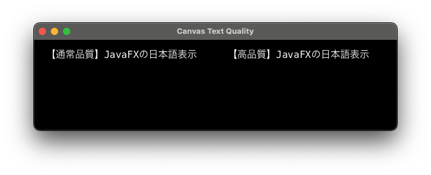

# What is this?

JavaFX is known for its poor font rendering quality.
This project aims to determine whether drawing the canvas with supersampling improves this quality.

The results showed that drawing with supersampling did not improve the rendering quality.

